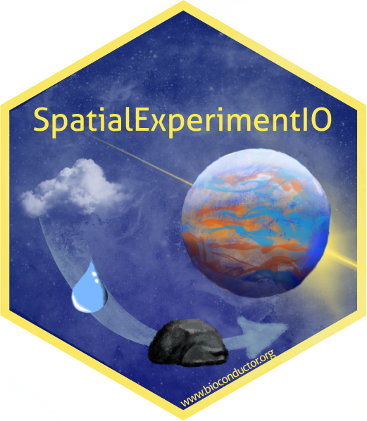

# Introduction



The `SpatialExperimentIO` package provides a set of functions to import Xenium (10x Genomics), CosMx (Nanostring), MERSCOPE (Vizgen), STARmapPLUS (Wang et al., 2023, Broad Institute), and seqFISH (Spatial Genomics) data into a `SpatialExperiment` or `SingleCellExperiment`class object.

# Installation

``` r
if (!require("BiocManager", quietly = TRUE))
    install.packages("BiocManager")
BiocManager::install("SpatialExperimentIO")
```

# Development version

You can also install the development version of *SpatialExperimentIO* from [GitHub](https://github.com/estellad/SpatialExperimentIO) with:

``` r
# install.packages("devtools")
devtools::install_github("estellad/SpatialExperimentIO")
```

# Load package

``` r
library(SpatialExperimentIO)
```

# Xenium ouptut folder structure

A standard Xenium output folder should contain these files for the function `readXeniumSXE()`. `cells.parquet` or `cells.csv.gz`, as well as either `cell_feature_matrix.h5` or `/cell_feature_matrix` are required for just a count matrix at cell-level and its column data. Other transcript, cell/nucleus boundaries, and experiment.xenium .parquet files will have their paths added to `metadata()`. Genes that are served as control probes can be moved to `altExp()` by specifying their gene name patterns in the reader `readXeniumSXE()`. 

```         
    Xenium_unzipped
        └── outs 
            ├── cells.parquet 
            ├── cell_feature_matrix.h5 
            └── cell_feature_matrix 
                ├── barcodes.tsv 
                ├── features.tsv 
                └── matrix.mtx
            ├── transcripts.parquet 
            ├── cell_boundaries.parquet     
            ├── nucleus_boundaries.parquet  
            └── experiment.xenium
```

# CosMx output folder structure

A standard CosMx output folder should contain these files for the function `readCosMxSXE()`. Both `metadata_file.csv` and `exprMat_file.csv` are required for just a count matrix at cell-level and its column data. Additional data `fov_positions_file.csv` can be merged to `colData()`. Other transcript and polygon .csv files will be convert and write to .parquet files, and will have their parquet paths added to `metadata()`. Genes that are served as control probes can be moved to `altExp()` by specifying their gene name patterns in the reader `readCosMxSXE()`. 

```         
    CosMx 
        ├── metadata_file.csv 
        ├── exprMat_file.csv
        ├── fov_positions_file.csv
        ├── tx_file.csv
        └── polygons.csv
        
```

# MERSCOPE output folder structure

A standard MERSCOPE output folder should contain these files for the function `readMerscopeSXE()`. Both `cell_metadata.csv` and `cell_by_gene.csv` are required for just a count matrix at cell-level and its column data. Cell boundaries are multiple .h5 files that are yet to be processed by `SpatialExperimentIO`. Transcript.csv files are available and is yet to be added as path to parquet in `SpatialExperimentIO`.

```         
    MERSCOPE 
        ├── cell_metadata.csv 
        └── cell_by_gene.csv
```

# STARmap PLUS output folder structure

A standard STARmap PLUS output folder should contain these files for the function `readStarmapplusSXE()`. Both `spatial.csv` and `raw_expression_pd.csv` are required for just a count matrix at cell-level and its column data.

```         
    STARmap_PLUS 
        ├── spatial.csv 
        └── raw_expression_pd.csv
```

# seqFISH output folder structure

A standard seqFISH output folder should contain these files for the function `readSeqfishSXE()`. Both `CellCoordinates.csv` and `CellxGene.csv` are required for just a count matrix at cell-level and its column data.

```         
    seqFISH 
        ├── CellCoordinates.csv 
        └── CellxGene.csv
```

# Usage

Taking Xenium as an example, providing a path to the folder that stores all the required files (i.e. `/outs` ) would return a `SpatialExperiment` object.

``` r
spe <- readXeniumSXE(dir)
spe
# class: SpatialExperiment 
# dim: 4 6 
# metadata(0):
# assays(1): counts
# rownames(4): AATK ABL1 ACKR3 ACKR4
# rowData names(3): ID Symbol Type
# colnames(6): 1 2 ... 5 6
# colData names(9): X cell_id ... nucleus_area sample_id
# reducedDimNames(0):
# mainExpName: NULL
# altExpNames(0):
# spatialCoords names(2) : x_centroid y_centroid
# imgData names(0):
```
